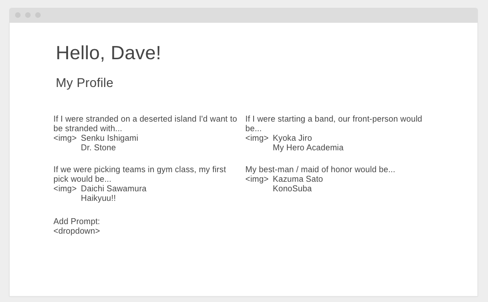

# Ani Cal
[https://ani-cal.herokuapp.com/](https://ani-cal.herokuapp.com/)

## Description
Ani Cal is a full stack web app designed to help users get their schedules for the upcoming anime seasons in order. As a user I can: 
- find upcoming anime or search for all the anime within a specific season.
- register for an account or login to my existing account to add anime to my personal calendar.
- spice up my profile by 
- - adding pre-written prompt questions to my profile and answering said prompt by searching for a specific character.
- - using a character portrait for my personal profile picture.
- find other users and compare our schedules.

Ani Cal is your solution to viewing your upcoming anime season schedule in a clear and concise manner!

## Project Planning
Here's how I planned out my project.
[HackMD planning document](https://hackmd.io/@d4vves/SknikncC8)
[Trello to-do list](https://trello.com/b/ITN2Calf)

### MVP
At a base level I wanted a user to be able to login or register for an account and then be able to query the API for anime. I chose to deliver an index page that served up popular upcoming anime broken out by the day of the week. From there, if you happen to be a more in-depth planner, you can search for a specific season of anime and view all of the shows within that season. Once you find a show that you're interested in you can add it to your personal calendar located on your profile page.

### Stretch Goals
- Better Profiling
As an anime enthusiast myself I've always felt that profile pages on all the different listing sites are a bit bland. They'll allow you to add a profile picture and they serve up a section where you can write a bio about yourself. But I felt like I wanted to allow users to better portray themselves non-verbally by having the ability to choose from a list of pre-written prompts and then answer that prompt by selecting a character that you will search the API for. For instance a user could select the prompt "if I were stranded on a deserted island, I'd want to be stranded with" and then search for a character that they'd want to be stranded on a deserted island with. How fun!

- Community
I wanted to include various ways of including a community aspect in my app. At a very base level, I wanted users to be able to view other users profiles to see their schedule, prompts and if they have any anime in common. From there I decided that I would like to include a second API. By querying the Twitter API we can now get a Twitter feed loaded on a view page of an individual anime and see what other fans are saying about that show!

### APIs Used
[Jikan](https://jikan.moe/)
[Twitter](https://developer.twitter.com/en/docs)

### Wireframes

## ERD

## Technologies Used
- HTML, CSS, JavaScript, Node.js, Sequelize.

## Dependencies
Axios, bcrypt, connect-flash, connect-session-sequelize, dotenv, ejs, express, express-ejs-layouts, express-session, flash, helmet, method-override, morgan, passport, passport-local, pg, sequelize, sequelize-cli.